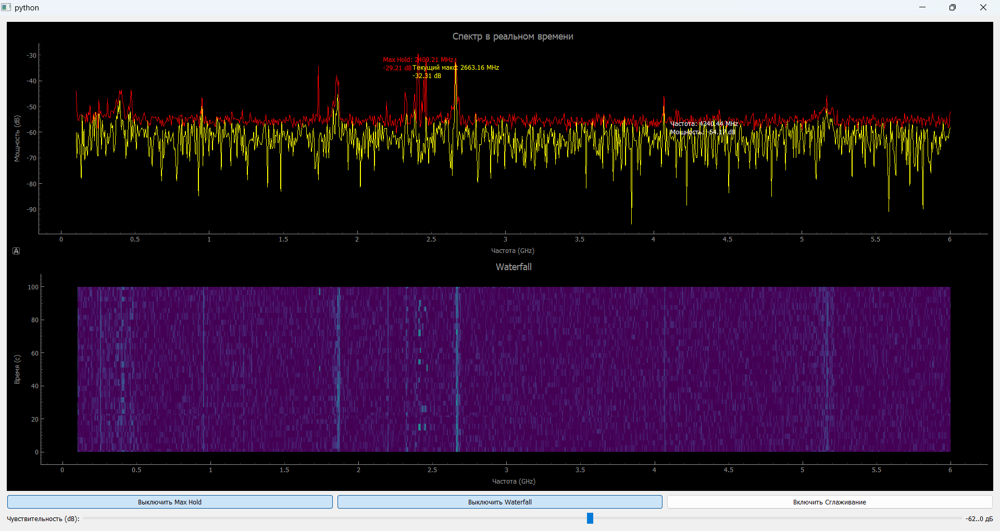
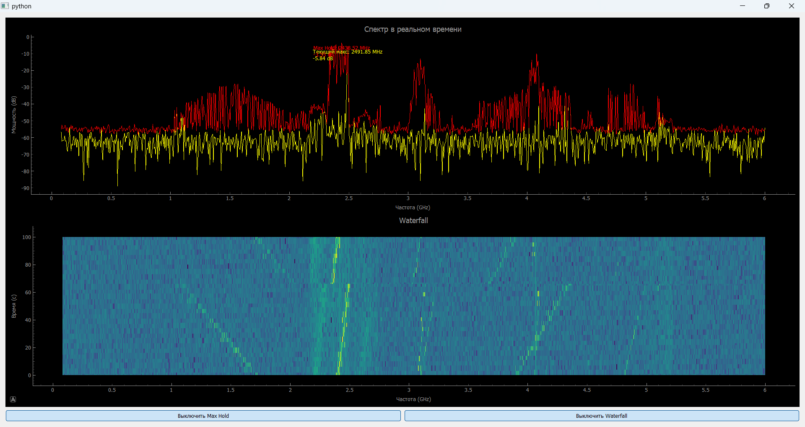

# HackRF one + raspberry pi
Python script that gets data from raspberry pi through ethernet and visualise them in server/laptop
Raspberry is connected to HackRF through USB

First you need to initialised your raspberry and download all libraries that you need to work with HackRF
Then run this python script, after that run this command in raspberry (for example through ssh):

```
hackrf_sweep -f 100:6000 -w 1000000 -l 20 -g 20 -N 1000 | nc 'IP of server/laptop' 5000
```


